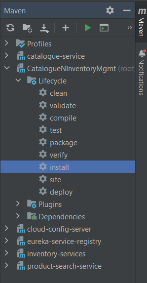

Run the installation command under the root of the application as shown in the below snapshot for reference 

Once all the jars are created in their respective target folders run the below build and run commands of docker one by one in the order given below. If not needed can skip the catalogue service with ports 78 and 79 which are optional

docker build -t <dockerUserName>/eureka-service-registry:0.0.1 .
docker run -p 8761:8761 --name eureka-service-registry <dockerUserName>/eureka-service-registry:0.0.1

docker build -t <dockerUserName>/cloud-config-server:0.0.1 .
docker run -p 9296:9296 --name cloud-config-server <dockerUserName>/cloud-config-server:0.0.1

Below set of commands are optional
docker build -t <dockerUserName>/catalogue-service78:0.0.1 .
docker run -p 8078:8078 --name catalogue-service78 <dockerUserName>/catalogue-service78:0.0.1

Below set of commands are optional
docker build -t <dockerUserName>/catalogue-service79:0.0.1 .
docker run -p 8079:8079 --name catalogue-service79 <dockerUserName>/catalogue-service79:0.0.1

docker build -t <dockerUserName>/catalogue-service:0.0.1 .
docker run -p 8080:8080 --name catalogue-service <dockerUserName>/catalogue-service:0.0.1

Since image of RabbitMq already exists, just run the container with below command
docker run -it --rm --name rabbitmq -p 5672:5672 -p 15672:15672 rabbitmq:3.12-management

docker build -t <dockerUserName>/inventory-service:0.0.1 .
docker run -p 8081:8081 --name inventory-service <dockerUserName>/inventory-service:0.0.1

docker build -t <dockerUserName>/product-search-service:0.0.1 .
docker run -p 8082:8082 --name product-search-service <dockerUserName>/product-search-service:0.0.1

once the above containers are running in the docker please run the below to see the documentation of the applications
http://host.docker.internal:8080/swagger-ui/index.html - Catalogue Documentation UI
http://host.docker.internal:8081/swagger-ui/index.html - Inventory Documentation UI
http://host.docker.internal:8082/swagger-ui/index.html - Product search Documentation UI

